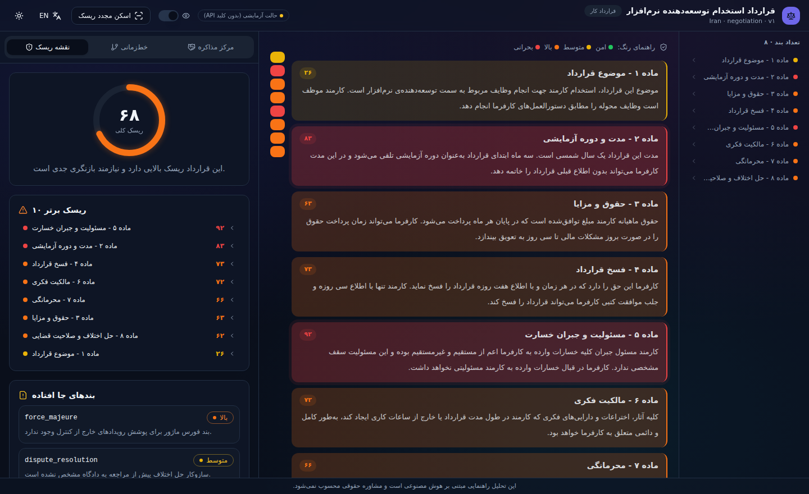
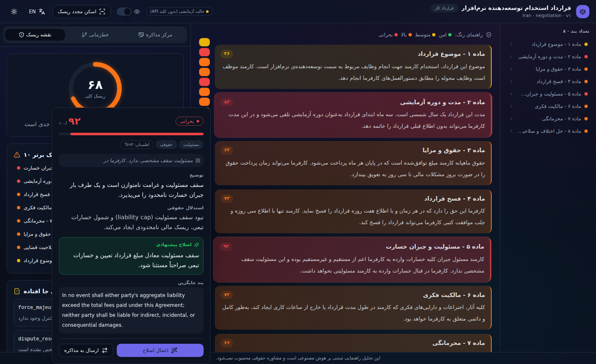
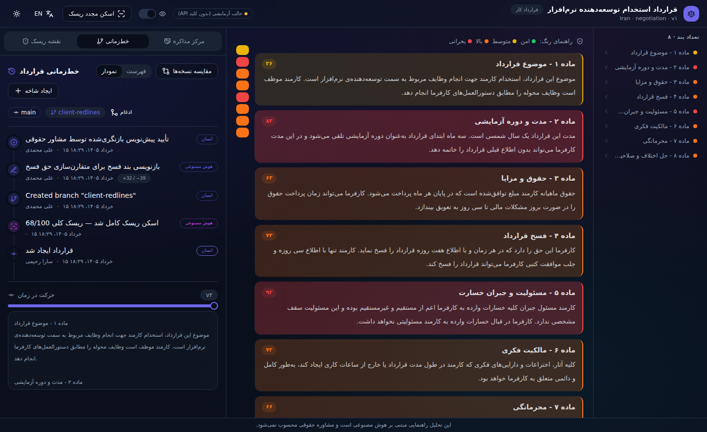
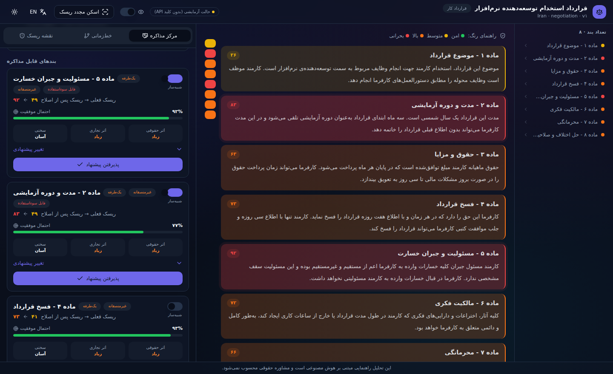
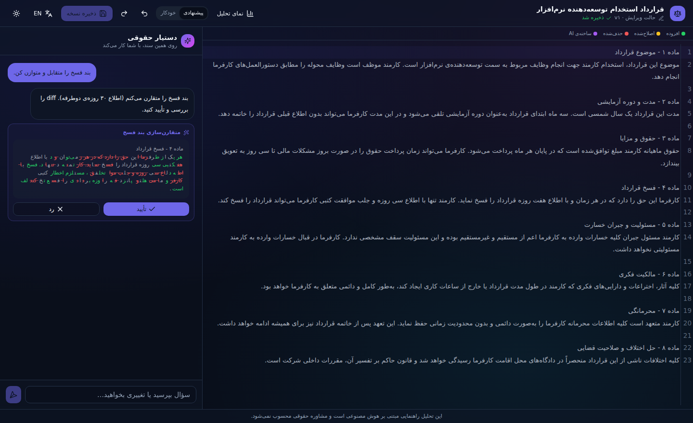
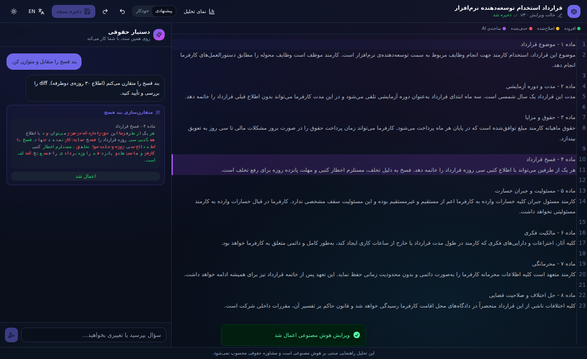
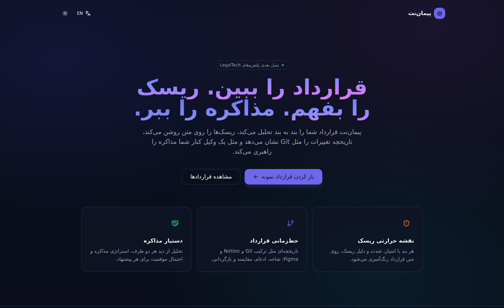
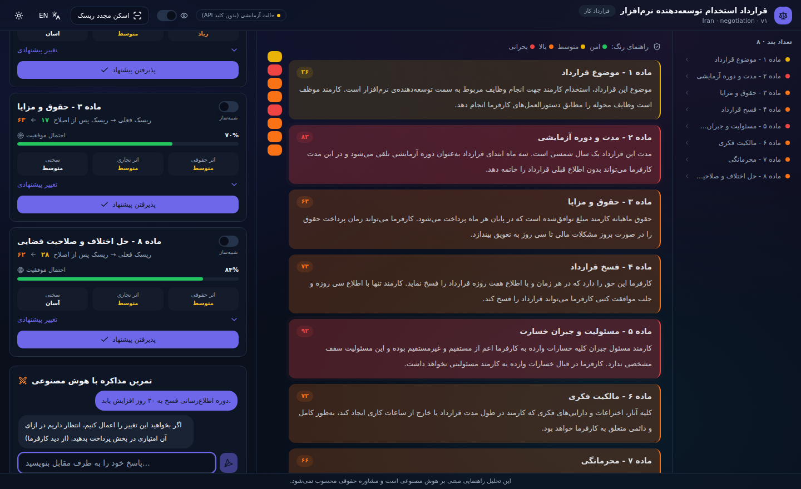
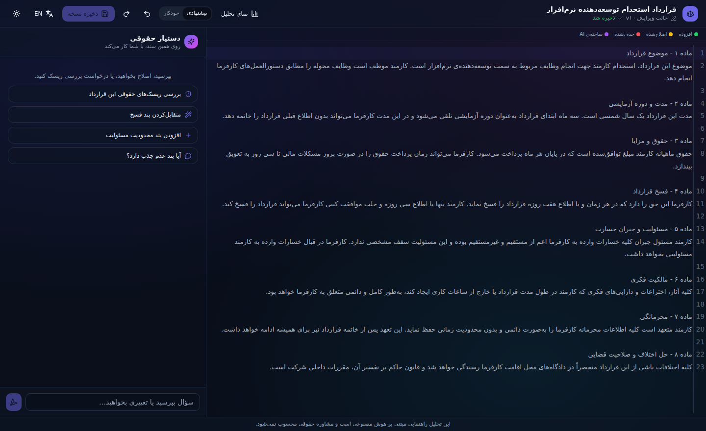
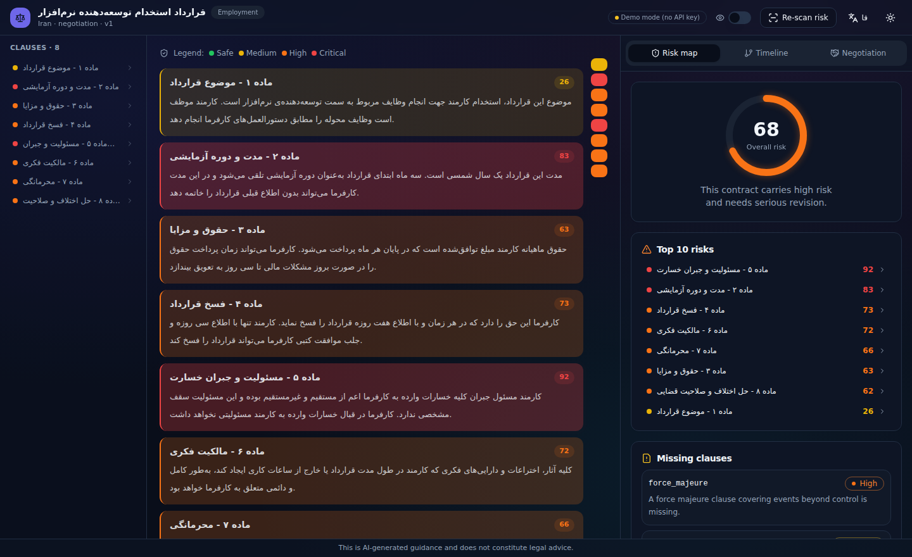

<div align="center">

# پیمانت · Peymanet

### AI‑Powered Contract Intelligence & Editor · هوش قراردادی مبتنی بر AI

نقشه‌ی حرارتی ریسک · خط‌زمانی Git‑مانند · دستیار مذاکره · ادیتور هوشمند قرارداد
**Risk Heatmap · Git‑style Timeline · Negotiation Assistant · AI Contract Editor**




</div>

---

## ✨ معرفی · Overview

**فارسی:** پیمانت یک پلتفرم LegalAI با **Next.js** است که قرارداد را بند به بند تحلیل می‌کند، ریسک را مستقیم روی متن رنگ‌آمیزی می‌کند، تاریخچه‌ی تغییرات را مثل Git مدیریت می‌کند، مثل یک وکیل کنار شما مذاکره را راهبری می‌کند، و یک **ادیتور Markdown با دستیار هوش مصنوعی** برای نگارش و اصلاح قرارداد دارد. کاملاً **دوزبانه (فارسی/انگلیسی، RTL‑first)**.

**English:** Peymanet is a **Next.js** LegalAI platform that analyzes a contract clause‑by‑clause, paints risk directly onto the text, manages change history like Git, guides negotiation like a lawyer at your side, and ships a **markdown editor with an AI assistant** for drafting and revising. Fully **bilingual (Persian/English, RTL‑first)**.

> 🟢 **Runs with NO API key.** Ships with a deterministic, contextual, bilingual **mock AI** so the entire product is demoable offline. Set `AI_MODE=openai` to use the real OpenAI engine — same code path.

---

## 🚀 شروع سریع · Quick Start

### گزینه A — Docker (یک دستور) · Option A — Docker (one command)

```bash
docker compose up --build
# → http://localhost:3000
```

این کانتینر به‌صورت خودکار schema را می‌سازد، یک قرارداد نمونه seed می‌کند و اپ را اجرا می‌کند (حالت mock، بدون نیاز به کلید).
The container auto‑creates the schema, seeds a sample contract, and serves the app (mock mode, no key needed).

برای OpenAI، یک فایل `.env` کنار `docker-compose.yml` بسازید · For OpenAI, create a `.env` next to `docker-compose.yml`:

```env
AI_MODE=openai
OPENAI_API_KEY=sk-...
```

### گزینه B — اجرای محلی · Option B — Local

```bash
npm install
cp .env.example .env        # defaults are fine for a local demo
npm run db:push             # create the SQLite dev database
npm run db:seed             # seed a bilingual sample employment contract
npm run dev                 # → http://localhost:3000
```

سپس از صفحه‌ی اصلی روی **«باز کردن قرارداد نمونه»** بزنید. · Then click **“Open sample contract”** on the home page.

---

## 🧠 حالت‌های هوش مصنوعی · AI Modes

`AI_MODE` را در `.env` تنظیم کنید · Controlled by `AI_MODE`:

| `AI_MODE` | Behavior |
|-----------|----------|
| `mock` (default) | Deterministic, contextual, bilingual results from `lib/ai/mock.ts`. No API key, no network. Ideal for demos, tests, offline. |
| `openai` | Live calls via the Vercel AI SDK. Works with **OpenAI**, **any OpenAI‑compatible endpoint** (reseller/proxy/gateway/OpenRouter/local LLM), or **Azure OpenAI**. |

**🔌 Bring your own endpoint · هر AI که خریده‌ای:**

```env
# OpenAI (default)
AI_MODE=openai
OPENAI_API_KEY=sk-...

# Any OpenAI-compatible provider (reseller / proxy / gateway / OpenRouter / local server)
AI_MODE=openai
OPENAI_API_KEY=your-key
OPENAI_BASE_URL=https://your-provider.example/v1
# OPENAI_HEADERS={"HTTP-Referer":"https://yourapp.com"}   # optional, if the gateway needs it

# Azure OpenAI  (OPENAI_MODEL = your *deployment* name)
AI_MODE=openai
AI_PROVIDER=azure
AZURE_RESOURCE_NAME=my-resource
AZURE_API_KEY=...
OPENAI_MODEL=my-gpt4o-deployment
```

با تنظیم `OPENAI_BASE_URL` می‌توانی AI خریداری‌شده از هر جای دیگر (هر endpoint سازگار با OpenAI) را استفاده کنی؛ برای Azure هم `AI_PROVIDER=azure` کافی است. همان مسیر کد و همان schemaهای Zod (`lib/ai/schemas.ts`) هر سه را پوشش می‌دهند — سوییچ فقط متغیر محیطی است.
Set `OPENAI_BASE_URL` to use AI bought from anywhere (any OpenAI‑compatible endpoint); for Azure just set `AI_PROVIDER=azure`. One code path, switched by env.

---

## 🗄 سوییچ به PostgreSQL (production)

schema برای Postgres آماده است. در `prisma/schema.prisma`:

```prisma
datasource db {
  provider = "postgresql"   // was "sqlite"
  url      = env("DATABASE_URL")
}
```

سپس `DATABASE_URL` را ست و `npm run db:push && npm run db:seed` را اجرا کنید. بدون تغییر مدل — enumها `String` (با اعتبارسنجی Zod) و JSON در ستون‌های String نگهداری می‌شوند.
Set `DATABASE_URL`, then `db:push && db:seed`. No model changes — enums are `String` (Zod‑validated) and JSON lives in String columns.

---

## 🧩 قابلیت‌ها · Features

### ۱) نقشه‌ی حرارتی ریسک · AI Risk Heatmap
هر بند روی متن قرارداد با امتیاز/شدت/دسته رنگ‌آمیزی می‌شود؛ با Hover یک کارت شناور (امتیاز، توضیح، استدلال حقوقی، اصلاح پیشنهادی، بند جایگزین) باز می‌شود؛ داشبورد سمت کنار شامل ریسک کلی، ۱۰ ریسک برتر، بندهای جاافتاده، انطباق و توصیه‌ها. اسکن **زنده و تدریجی** با SSE.



### ۲) خط‌زمانی قرارداد · Contract Timeline (Git × Notion × Figma)
هر تغییر یک رویداد می‌سازد؛ نمودار commit عمودی، diff خط‌قرمزی، مقایسه‌ی هر دو نسخه، شاخه‌بندی و **ادغام سه‌طرفه با تشخیص تعارض**، بازگردانی غیرمخرب و Time‑Scrubber.



### ۳) دستیار مذاکره · AI Negotiation Assistant
تحلیل از دید هر طرف (کارمند/کارفرما، خریدار/فروشنده، …)؛ برای هر بند: تغییر پیشنهادی، استراتژی، پاسخ احتمالی طرف مقابل و پاسخ شما + **احتمال موفقیت / سختی / اثر تجاری / اثر حقوقی**؛ امتیاز فرصت، چک‌لیست، نکات گفت‌وگو، **شبیه‌ساز what‑if کاهش ریسک** و **چت War‑game** که AI نقش طرف مقابل را بازی می‌کند.



### ۴) ادیتور هوشمند قرارداد · AI Contract Editor
ادیتور Markdown (CodeMirror) با شماره‌خط، **رهگیری تغییر خط‌به‌خط** (افزوده=سبز، اصلاح=زرد، حذف=قرمز، **ساخته‌ی AI=بنفش**)، autosave و Save‑version؛ کنارش یک **دستیار چت روی سند**: پرسش‌وپاسخ، پیشنهاد ویرایش (diff → accept/reject)، درج بند و بررسی ریسک — با دو حالت **Suggest / Auto‑apply**.




---

## 🏗 معماری · Architecture

اپلیکیشن Next.js (App Router) لایه‌بندی‌شده، با یک **ستون فقرات داده‌ی مشترک**: نقشه‌ی ریسک ارزیابی‌ها را می‌سازد، مذاکره از آن‌ها استفاده می‌کند، و هر تغییر یک `TimelineEvent` (لاگ حسابرسی تغییرناپذیر) ثبت می‌کند.

- **`app/`** — صفحات (RSC)، Server Actions (`actions.ts`)، و مسیر SSE تحلیل
- **`lib/ai/`** — providers · prompts · schemas (Zod) · mock · cache · models
- **`lib/db/`** — Prisma · `queries.ts` (لودر workspace) · json helpers
- **`lib/events/`** — event‑sourcing: versions · branches · 3‑way merge · `recordEvent`
- **`lib/diff` · `lib/risk` · `lib/negotiation`** — موتور diff، تجمیع ریسک، شبیه‌ساز
- **`components/`** — `workspace/ heatmap/ timeline/ negotiation/ editor/ shared/ ui/`

جزئیات کامل (UX، schema، API، Prompt Engineering، انیمیشن‌ها، …) در **[`DESIGN.md`](DESIGN.md)** (دوزبانه، ۱۳ بخش).

---

## 📁 ساختار پروژه · Project Structure

```
app/                routes, server actions, SSE analyze route
components/
  workspace/  heatmap/  timeline/  negotiation/  editor/  shared/  ui/
lib/
  ai/   db/   events/   diff/   risk/   negotiation/   i18n/   constants
prisma/             schema.prisma · seed.ts
messages/           fa.json · en.json
docs/screenshots/   UI screenshots used in this README
Dockerfile · docker-compose.yml
```

---

## 🧪 اسکریپت‌ها · Scripts

| Script | Purpose |
|--------|---------|
| `npm run dev` | Dev server |
| `npm run build` / `start` | Production build / serve |
| `npm run typecheck` | `tsc --noEmit` |
| `npm test` | Vitest (merge, diff, risk aggregation, simulator, mock schema) |
| `npm run db:push` / `db:seed` / `db:reset` | Prisma push / seed / reset+seed |

---

## 🖼 گالری · Gallery

| | |
|---|---|
|  |  |
|  |  |
|  |  |

---

## ⚖️ سلب مسئولیت · Disclaimer

خروجی‌های این محصول **راهنمایی مبتنی بر هوش مصنوعی** است و **مشاوره‌ی حقوقی** محسوب نمی‌شود.
Outputs are **AI‑generated guidance** and **do not constitute legal advice**.
